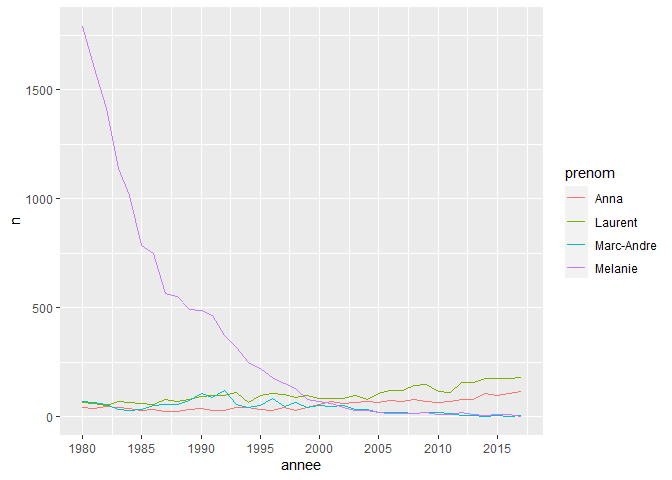

<!-- README.md is generated from README.Rmd. Please edit that file -->

[](https://travis-ci.org/desautm/prenoms)

# prenoms

The goal of `prenoms` is to give the names of babies born in Quebec
between 1980 and 2020.

## Installation

You can install `prenoms` from github with:

``` r
# install.packages("devtools")
devtools::install_github("desautm/prenoms")
```

## Example 1

Here is the graph of the first names of the four members of my family,
between 1980 and 2020.

``` r
library(tidyverse)
#> -- Attaching packages --------------------------------------- tidyverse 1.3.1 --
#> v ggplot2 3.3.3     v purrr   0.3.4
#> v tibble  3.1.1     v dplyr   1.0.5
#> v tidyr   1.1.3     v stringr 1.4.0
#> v readr   1.4.0     v forcats 0.5.1
#> -- Conflicts ------------------------------------------ tidyverse_conflicts() --
#> x dplyr::filter() masks stats::filter()
#> x dplyr::lag()    masks stats::lag()
library(prenoms)
```

``` r
family <- prenoms %>%
  filter(
    name == "Marc-Andre" & sex == "M" |
    name == "Laurent" & sex == "M" |
    name == "Melanie" & sex == "F" |
    name == "Anna" & sex == "F"
  ) %>%
  group_by(name, year, sex) %>%
  summarise(n = sum(n)) %>%
  arrange(year)
#> `summarise()` has grouped output by 'name', 'year'. You can override using the `.groups` argument.

ggplot(data = family, aes(x = year, y = n, color = name))+
  geom_line()+
  scale_x_continuous( breaks = seq(1980, 2020, by = 5))
```



## Example 2

The five most popular female names in 2020.

``` r
prenoms %>%
  filter(year == 2020 & sex == "F") %>%
  select(year, sex, name, n) %>%
  arrange(desc(n)) %>%
  head(5)
#> # A tibble: 5 x 4
#>    year sex   name          n
#>   <int> <chr> <chr>     <int>
#> 1  2020 F     Olivia      543
#> 2  2020 F     Alice       491
#> 3  2020 F     Emma        491
#> 4  2020 F     Charlie     488
#> 5  2020 F     Charlotte   449
```

## Example 3

The five most popular male names in 2020.

``` r
prenoms %>%
  filter(year == 2020 & sex == "M") %>%
  select(year, sex, name, n) %>%
  arrange(desc(n)) %>%
  head(5)
#> # A tibble: 5 x 4
#>    year sex   name        n
#>   <int> <chr> <chr>   <int>
#> 1  2020 M     Liam      661
#> 2  2020 M     William   644
#> 3  2020 M     Noah      639
#> 4  2020 M     Thomas    594
#> 5  2020 M     Leo       572
```
