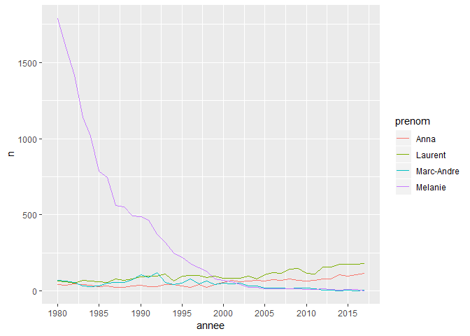

<!-- README.md is generated from README.Rmd. Please edit that file -->
prenoms
=======

Le but de prenoms est de donner les prénoms des enfants du Québec de 1980 à 2017.

Installation
------------

Vous pouvez installer prenoms à partir de github avec:

``` r
# install.packages("devtools")
devtools::install_github("desautm/prenoms")
```

Exemple
-------

This is a basic example which shows you how to solve a common problem:

``` r
library(dplyr)
#> 
#> Attaching package: 'dplyr'
#> The following objects are masked from 'package:stats':
#> 
#>     filter, lag
#> The following objects are masked from 'package:base':
#> 
#>     intersect, setdiff, setequal, union
library(ggplot2)
library(prenoms)
```

``` r
famille <- prenoms %>%
  filter(
    prenom == "Marc-Andre" & sexe == "M" |
    prenom == "Laurent" & sexe == "M" |
    prenom == "Melanie" & sexe == "F" |
    prenom == "Anna" & sexe == "F"
  ) %>%
  group_by(prenom, annee, sexe) %>%
  summarise(n = sum(n)) %>%
  arrange(annee)

ggplot(data = famille, aes(x = annee, y = n, color = prenom))+
  geom_line()+
  scale_x_continuous( breaks = seq(1980, 2020, by = 5))
```


