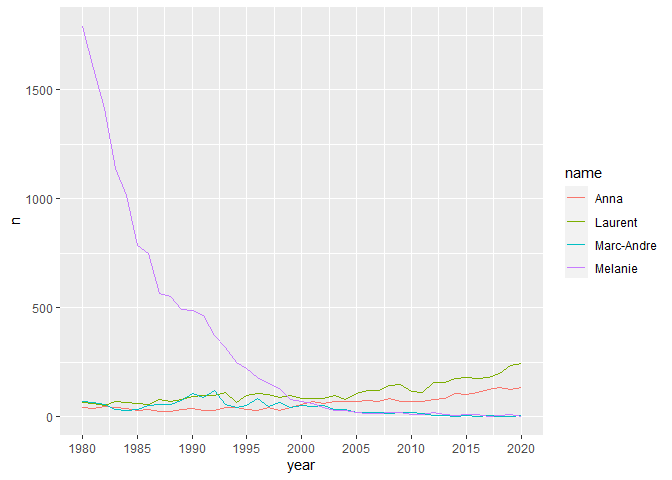

<!-- README.md is generated from README.Rmd. Please edit that file -->

[](https://travis-ci.org/desautm/prenoms)

# prenoms

Le but de prenoms est de donner les prénoms des enfants du Québec de
1980 à 2020.

## Installation

Vous pouvez installer prenoms à partir de github avec:

``` r
# install.packages("devtools")
devtools::install_github("desautm/prenoms")
```

## Exemple 1

Voici la répartition des quatre prénoms des membres de ma famille de
1980 à 2020.

``` r
library(tidyverse)
#> -- Attaching packages --------------------------------------- tidyverse 1.3.1 --
#> v ggplot2 3.3.3     v purrr   0.3.4
#> v tibble  3.1.1     v dplyr   1.0.5
#> v tidyr   1.1.3     v stringr 1.4.0
#> v readr   1.4.0     v forcats 0.5.1
#> -- Conflicts ------------------------------------------ tidyverse_conflicts() --
#> x dplyr::filter() masks stats::filter()
#> x dplyr::lag()    masks stats::lag()
library(prenoms)
```

``` r
famille <- prenoms %>%
  filter(
    prenom == "Marc-Andre" & sexe == "M" |
    prenom == "Laurent" & sexe == "M" |
    prenom == "Melanie" & sexe == "F" |
    prenom == "Anna" & sexe == "F"
  ) %>%
  group_by(prenom, annee, sexe) %>%
  summarise(n = sum(n)) %>%
  arrange(annee)
#> `summarise()` has grouped output by 'prenom', 'annee'. You can override using the `.groups` argument.

ggplot(data = famille, aes(x = annee, y = n, color = prenom))+
  geom_line()+
  scale_x_continuous( breaks = seq(1980, 2020, by = 5))
```



## Exemple 2

Les 5 prénoms féminins les plus populaires en 2020.

``` r
prenoms %>%
  filter(annee == 2020 & sexe == "F") %>%
  select(annee, sexe, prenom, n) %>%
  arrange(desc(n)) %>%
  head(5)
#> # A tibble: 5 x 4
#>   annee sexe  prenom        n
#>   <int> <chr> <chr>     <int>
#> 1  2020 F     Olivia      543
#> 2  2020 F     Alice       491
#> 3  2020 F     Emma        491
#> 4  2020 F     Charlie     488
#> 5  2020 F     Charlotte   449
```

## Exemple 3

Les 5 prénoms masculins les plus populaires en 2020.

``` r
prenoms %>%
  filter(annee == 2020 & sexe == "M") %>%
  select(annee, sexe, prenom, n) %>%
  arrange(desc(n)) %>%
  head(5)
#> # A tibble: 5 x 4
#>   annee sexe  prenom      n
#>   <int> <chr> <chr>   <int>
#> 1  2020 M     Liam      661
#> 2  2020 M     William   644
#> 3  2020 M     Noah      639
#> 4  2020 M     Thomas    594
#> 5  2020 M     Leo       572
```
